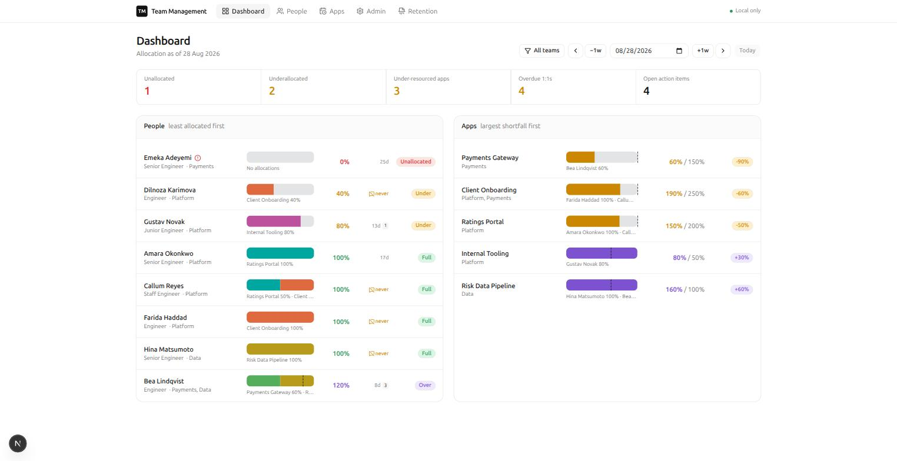
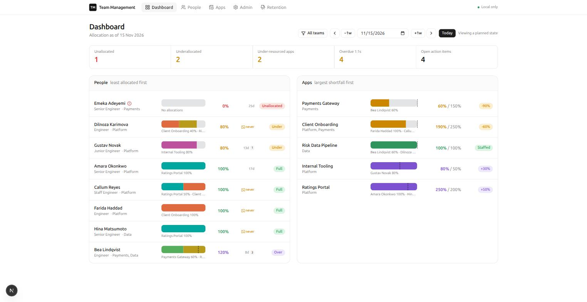
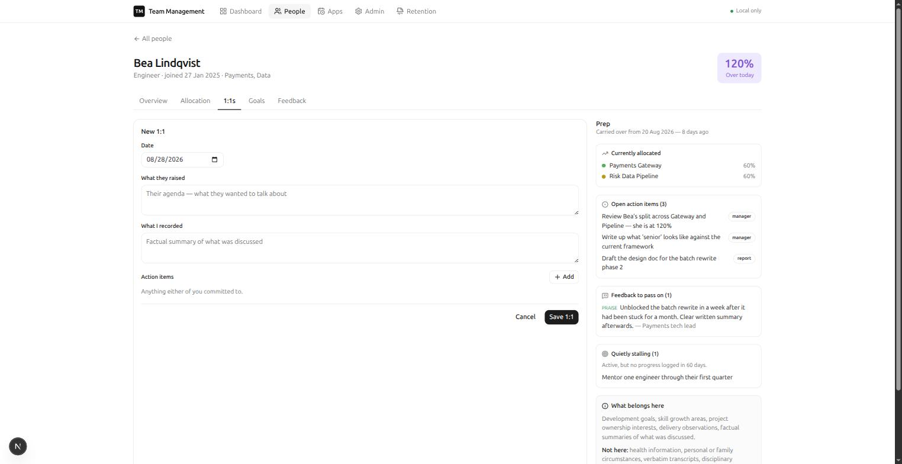
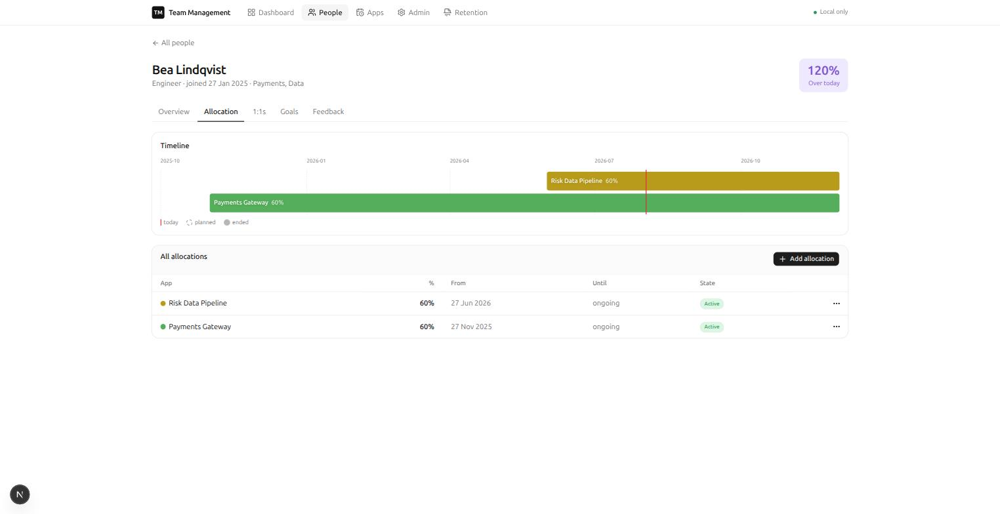
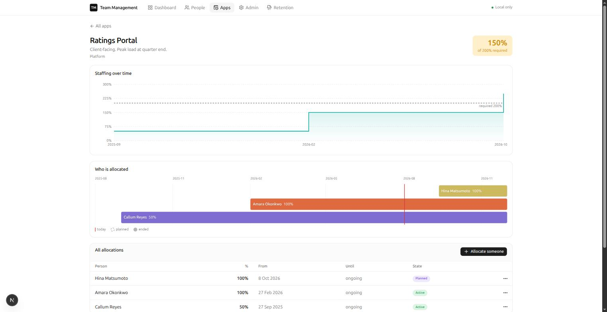

# Team Management Tool

A local-first tool for engineering managers, covering two halves of the job that
are usually handled by two unrelated tools — or by a spreadsheet and memory.

**Module A — Allocation.** Who is working on what, at what percentage, *as of any
date*: past, present or planned. Under- and over-allocation surfaced on both
sides, people and apps.

**Module B — People.** 1:1 records, goals and feedback per report, with
continuity across months.

The two are connected on purpose. When you sit down to prepare a 1:1, the tool
shows what that person is actually allocated to next to their goals and recent
conversations — because allocation reality is usually half the substance of the
conversation.

Everything runs on your own machine against two SQLite files. No cloud, no
account, no telemetry, no network calls carrying your data.



---

## Contents

- [What it does](#what-it-does)
- [Screens](#screens)
- [Running it](#running-it)
- [Architecture](#architecture)
- [Moving to another laptop](#moving-to-another-laptop)
- [Data handling](#data-handling)
- [Development](#development)

---

## What it does

### Time travel is the core idea

An allocation is never edited in place. Changing someone's percentage ends the
current row and creates a successor, so the history stays queryable: every
screen is the same "as of date D" query with a different D. Set the date to
last quarter and you see what the team actually looked like; set it forward and
you see what you have planned.



*The same dashboard three months out — "Viewing a planned state", and Risk Data
Pipeline reaches full staffing once a planned allocation begins.*

### Over-allocation warns, it never blocks

Real allocation legitimately goes over 100% during crunch. The tool flags it —
loudly, in the person's row and as a banner on save — but the save always
succeeds. Overlapping date ranges and impossible percentages *are* blocked;
being overcommitted is a fact to see, not an error to prevent.

The check runs per point in time across the range you touched, so shortening an
allocation that ends a breach clears the warning, and a breach three months out
is still reported today.

### Preparation is carried, not remembered

Opening a new 1:1 assembles what changed since the last one: open action items
either of you committed to, feedback you logged but have not passed on yet,
goals that have quietly stalled, and allocation changes made since you last
spoke.



*The prep panel sits beside the notes while you write. The guidance card is
part of the data-handling design, not decoration — it states what belongs in
these records and what does not.*

---

## Screens

| | |
|---|---|
| **Dashboard** | People and apps as of any date, sorted so the problems float to the top. Team filter, summary counts. |
| **Person view** | Overview, 1:1s, Goals, Feedback, and a Gantt-style allocation timeline — one route per tab, so tabs are linkable and survive a refresh. |
| **App detail** | Staffing over time against required capacity, who is allocated when, and the change history. |
| **Admin** | People, teams and apps. Deactivate — never delete. |
| **Retention review** | Old 1:1 notes and feedback, listed and bulk-deleted. |



*A person's allocation timeline. The vertical line is today; bars extend into
planned future work.*



*Staffing over time, sampled at allocation boundaries rather than fixed
intervals — every step in the line is a real change, not an artefact of the
sampling rate.*

---

## Running it

Requires Node 24+ (see `.nvmrc`). No Docker, no database server, no build
toolchain.

```sh
npm ci
npm run db:migrate     # creates data/ and both databases
npm run db:seed        # optional — sample data, fictional names
npm run build && npm start
```

Open <http://127.0.0.1:3000>. It binds to loopback only.

Prefer `build && start` over leaving `npm run dev` running: the dev server does
not prefetch, so navigation feels slower than the real thing.

---

## Architecture

| | |
|---|---|
| Framework | Next.js 16.3 (App Router, Turbopack), React 19, TypeScript strict |
| Data | SQLite via better-sqlite3, Drizzle ORM, migrations committed |
| UI | Tailwind v4, shadcn/ui, Recharts |
| Tests | `node --test` on `.ts` files — zero test dependencies |

```
src/
  app/          routes; loading.tsx per segment
  components/   ui/ is shadcn; the rest feature-grouped
  db/           {allocation,people}/ — one connection each
  data/         reads: allocation.ts | people.ts
  actions/      "use server" mutations
  domain/       pure logic + colocated tests
```

**Two databases, never joined in SQL.** `allocation.db` and `people.db` are
separate files with no `ATTACH` and no cross-file foreign key. Module B stores
`user_id` as a plain integer and the join happens in the component tree. This
is what makes the next point possible rather than aspirational.

**Module A works with `people.db` absent.** Delete it, and allocation still
works completely — the dashboard drops its Module B columns instead of showing
zeros, and people screens say the records are not present. There is a standing
acceptance test for exactly this.

**Dates are text, intervals are half-open.** `YYYY-MM-DD` sorts
lexicographically, so "as of D" is a plain SQL comparison. `[start, end)` means
an allocation ending on D is already gone on D — no off-by-one when one
assignment ends and another begins the same day.

**Changes are transactional.** better-sqlite3 is synchronous, so ending a row,
inserting its successor and writing both audit entries is one real transaction
with no await points inside it. The audit trail is only worth having if it
cannot half-happen.

The full design — domain model, validation rules, screen specs and the
data-handling regime — is in
[`team-management-tool-design.md`](team-management-tool-design.md). The code
cites it by section (`§4.2`, `§9.5`), and those citations are meant to be
followed.

---

## Moving to another laptop

Everything needed to rebuild the app is in git. **Your data is not**, and must
not be: `data/` is gitignored because `people.db` holds personal data about
identifiable colleagues. So a transfer is two steps.

**On the old machine:**

```sh
npm run db:backup                 # → backup/<timestamp>/
```

This uses SQLite's `VACUUM INTO`, not a file copy — a live database keeps recent
commits in a `-wal` sidecar, so copying `allocation.db` by hand can silently
lose your latest edits. Each file is integrity-checked, and a `manifest.json`
records row counts so you can confirm the transfer landed intact.

Move the repository and the backup directory across yourself. `backup/` is
gitignored; use a USB stick or an encrypted volume, not a cloud drive, if it
contains `people.db`.

**On the new machine:**

```sh
nvm use                                  # or fnm use
npm ci
cp .env.example .env
npm run db:restore -- path/to/backup     # data first
npm run db:migrate                       # then top up any newer migrations
npm run build && npm start
```

Restore *before* migrate: the backup carries its own migration history, so
`db:migrate` applies only what was added since — and correctly does nothing if
the backup is current.

`db:restore` refuses to overwrite an existing database without `--force`, and
never touches a database the backup does not contain.

**Do not copy `node_modules/`.** It holds a binary compiled for the old
machine's OS and CPU; `npm ci` fetches the right one.

### Taking the allocation data without the people data

```sh
mkdir transfer && cp backup/<timestamp>/allocation.db transfer/
npm run db:restore -- transfer
```

The app runs normally and Module B screens report that the records are not
present. Useful for a demo, a screenshot, or handing the allocation side to
someone else.

---

## Data handling

Module B holds notes about identifiable people, so it is built to a stricter
standard than the rest of the app:

- **It never leaves the machine.** No cloud sync, no telemetry, no AI API
  processing note content. A production Content-Security-Policy with
  `connect-src 'self'` makes the browser enforce it rather than trusting a
  promise.
- **It is never cached or prerendered.** Note text does not enter the build
  output or a cache directory.
- **Deletion is real.** Removing a person's records is a hard delete in one
  transaction — no soft-delete flag, no archive table.
- **Records expire.** The retention review lists 1:1s and feedback older than a
  configurable window (default 24 months) and deletes them in bulk. The default
  posture is that old notes go, rather than accumulate.
- **Deactivating a leaver prompts** to delete their Module B records. It is a
  prompt, never a cascade: their allocation history stays for capacity
  analysis, their personal notes need not.

When removing `people.db` from a machine, delete its sidecars too — a `-wal`
holds committed pages that a clean shutdown checkpoints away but a crash does
not:

```sh
rm -f data/people.db data/people.db-wal data/people.db-shm
```

---

## Development

```sh
npm run dev                   # 127.0.0.1:3000
npm test                      # domain unit tests
npm run lint && npm run typecheck
npm run db:reset              # wipe and reseed
```

Contributor notes, including the invariants that are easy to break, are in
[`AGENTS.md`](AGENTS.md).

Two settings that look removable and are not:

- **`.npmrc` sets `ignore-scripts`.** better-sqlite3 ships prebuilt binaries but
  also a `binding.gyp` with no install script, and npm reacts to that pair by
  running `node-gyp rebuild` — which needs a C++ toolchain most laptops lack.
  Removing the line breaks `npm ci` on a clean machine.
- **`.gitignore` directory rules are anchored** (`/data/`, not `data/`). An
  unanchored rule matches at any depth; `data/` once silently kept the whole of
  `src/data/` out of the repository.

---

Built with [Claude Code](https://claude.com/claude-code).
